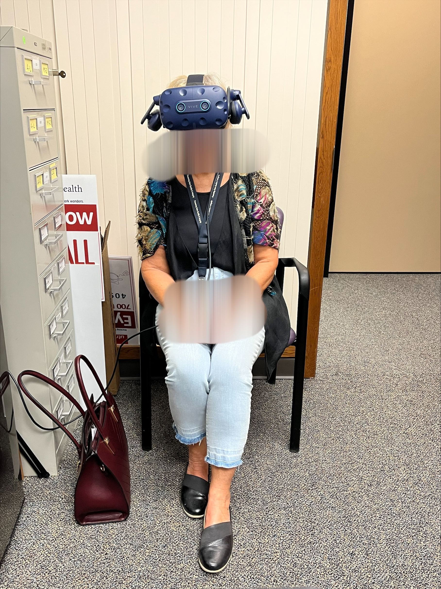

__04 May, 2023__: VR-SFT RAPD Assessment in Galveston, TX

Our system is now up and running in Galveston, TX for the IRB approved human study.

__03 October, 2022__: Presented our research papers in International Symposium on Visual Computing conference in San Diego, California.

__29 September, 2022__: Attended annual meeting of American Academy of Ophthalmology (AAO) in Chicago, Illinois.

__02 September, 2022__: Successfully completed National I-Corps program.

__10 August, 2022__: Attended 24th International Visual Field & Imaging Symposium at Berkeley, California.

__15 July, 2022__: Began National I-Corps program (New York) and was awarded $50,000 by National Science Foundation for our research

__01 June, 2022__: Returned as Education Mentor for Army Educational Outreach Program (AEOP) for summer 2022

__01 June, 2021__: Started a new position as Education Mentor for Army Educational Outreach Program (AEOP) for summer 2021

__01 January, 2021__: Started Ph.D. program in computer science at the University of Nevada, Reno

__31 December, 2020__: Left job at EchoLogyx Ltd.

__01 January, 2020__: Promoted to Team Lead / Senior Software QA Engineer 

__10 June, 2019__: New job at EchoLogyx Ltd. as Software QA Engineer

__June, 2018__: New job at Loence Solution as Product Officer

__February, 2018__: Started MBA at Institute of Business Administration, University of Dhaka

__14 Novemver, 2017__: Started new job at Energypac Engineering Ltd. (Testing and Commissioning Dept) as Assistant Engineer 

__13 September, 2017__: Completed bachelor degree from Bangladesh University of Engineering and Tecnology in Electrical and Electronic Engineering

