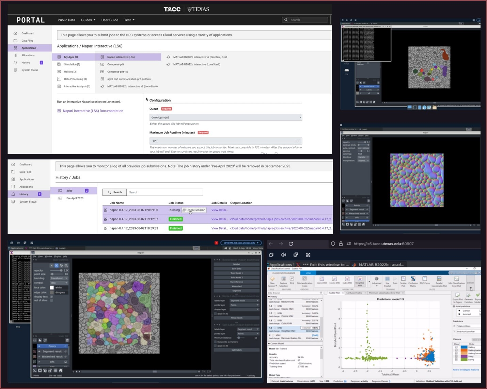
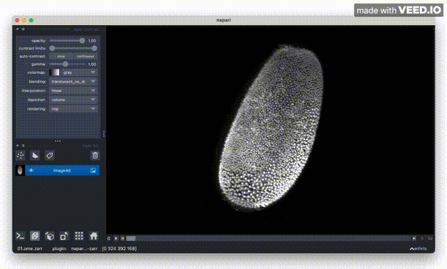
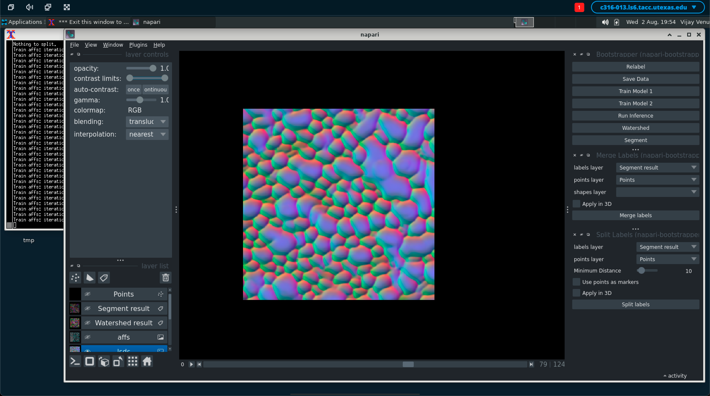
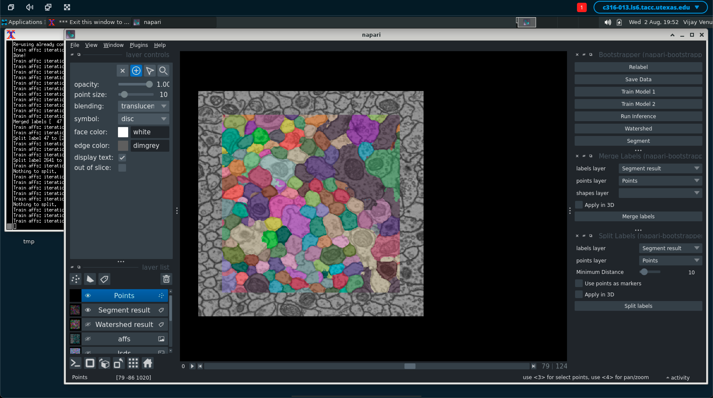
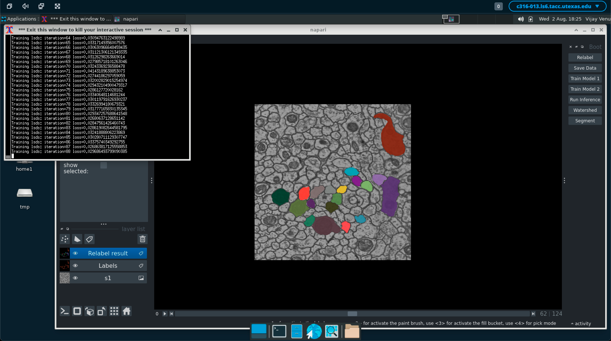

## Interactive Remote Jobs in Cluster Computing: Practical Methods and Access via User-Friendly Portals
### Team: Prit Sarker, Sal Tijerina, Tracy Brown, Alireza Tavakkoli

<!---

-->

### Abstract:

The demand for interactive remote jobs within cluster computing is a prevalent necessity. This requirement arises when engaging with software featuring interactive components such as Matlab, which encompass their own interactive interpreters and graphical interfaces. The convenience of interactive remote jobs lies in their ability to offer a dynamic and real-time interaction with the cluster, enabling researchers to efficiently engage with software, experiment, and perform tasks without the constraints of pre-determined workflows.
However, the prospect of creating a personal interactive session through the command line demands a certain level of technical proficiency and familiarity with intricate syntax and commands. Non-technical researchers might find themselves grappling with the complexities of configuring environment variables and managing dependencies, which can be time-consuming and potentially counterproductive to their primary research objectives.

To tackle the challenge of setting up interactive sessions through the TAPIS framework, a viable solution involves employing multi-stage Docker builds.

•	In the initial stage, a Virtual Network Computing (VNC) or a Desktop Cloud Visualization (DCV) connection are established. This configuration facilitates the setup of a remote desktop connection, capitalizing on the Texas Advanced Computing Center's (TACC) interactive base docker image as the foundation. 

•	The subsequent stage of the multi-stage Docker build is dedicated to executing the desired application. This is achieved by deploying the application within its own customized docker image, built upon the previously established interactive base. By layering the application-specific docker image onto the interactive base, researchers can integrate their intended application into the interactive environment.

This approach ensures the isolation and encapsulation of the application within its containerized environment, avoiding conflicts or interference with the underlying interactive session. To access this application, users engage with portals which are designed to optimize accessibility and efficiency. Below are the instructions to initiate the application:
•	To initiate the process, users navigate through the application list on the portal, select their desired application, and provide necessary parameters to configure the job according to their needs and objectives.

•	Upon submission of the job, the application commences its execution within the computing environment, making an additional button available. This feature streamlines the transition from job submission to active interaction,

•	Upon clicking the "open session" button, users are prompted to provide the appropriate credentials to establish their identity and access privileges. This security measure ensures that only authorized individuals gain entry to the application remote session, safeguarding data and maintaining system integrity.

•	Once authenticated, users can engage with the application's interface, features, and functionalities as if it were a native application running on their local machine. 

This methodology not only optimizes user engagement by eliminating unnecessary navigation steps, but also provides a secure and controlled environment for interacting with the application. By removing obstacles and simplifying the entry into the remote session, researchers can focus on their work without being distracted by complicated technical details. This encourages a quicker and more organized use of the application through the portal.
